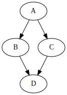

---
aliases:
- /2013/12/23/visualizing-network-with-graphviz/
- /post/2013-12-23-visualizing-network-with-graphviz
categories:
- tech
date: '2013-12-23'
tags:
- openstack
- neutron
- networking
title: Visualizing Neutron Networking with GraphViz
---

I've put together a few tools to help gather information about your
Neutron and network configuration and visualize it in different ways.
All of these tools are available as part of my [neutron-diag][]
repository on GitHub.

[neutron-diag]: http://github.com/larsks/neutron-diag/

In this post I'm going to look at a tool that will help you visualize
the connectivity of network devices on your system.

<!-- more -->

## mk-network-dot

There are a lot of devices involved in your Neutron network
configuration.  Information originating in one of your instances has
two traverse *at least* seven network devices before seeing the light
of day.  Understanding how everything connects is critical if you're
trying to debug problems in your envionment.

The `mk-network-dot` tool interrogates your system for information
about network devices and generates [dot format][] output showing how
everything connects.  You can use [GraphViz][] to render this into a
variety of output formats.  The script must be run as `root`, so I
usually do something like this:

    sudo sh mk-network-dot | dot -Tsvg -o network.svg

The *dot* language is a language designed for describing graphs, and
the syntax looks something like this:

    digraph example {
      A -> B
      A -> C
      C -> D
      B -> D
    }

Which would produce output like this:

When run on my laptop, with a simple all-in-one configuration and five
instances across two networks, the result of running `mk-network-dot`
looks like this:



There are a few caveats with this tool:

- As of this writing, it doesn't know about either bond interfaces or
  VLAN interfaces.
- It's had only limited testing.

If you try this out and something doesn't work as you expect, please
open a new issues on the [GitHub issues page][issues].

[dot format]: http://en.wikipedia.org/wiki/DOT_%28graph_description_language%29
[graphviz]: http://www.graphviz.org/
[issues]: https://github.com/larsks/neutron-diag/issues
